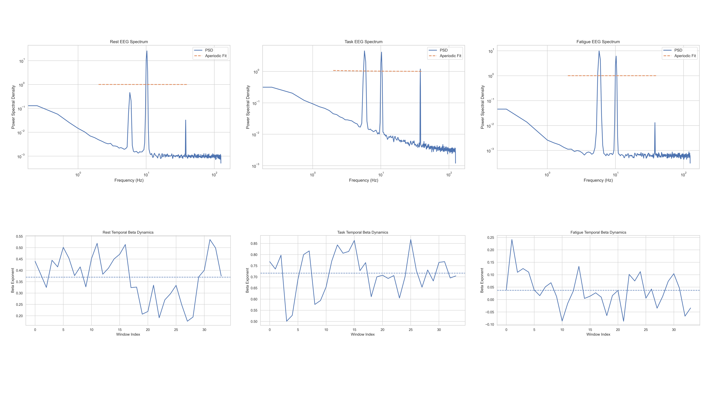
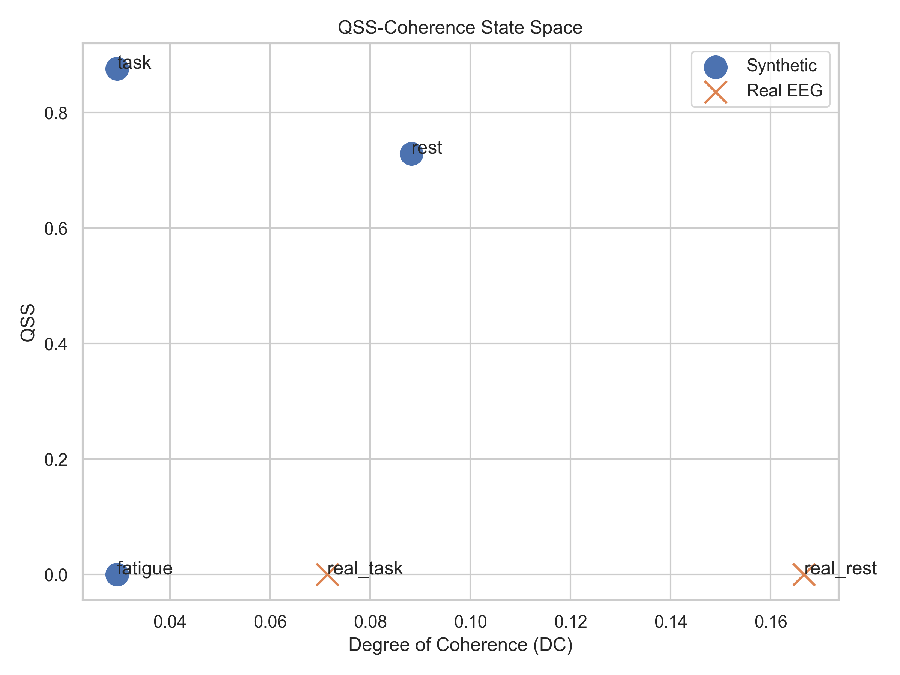
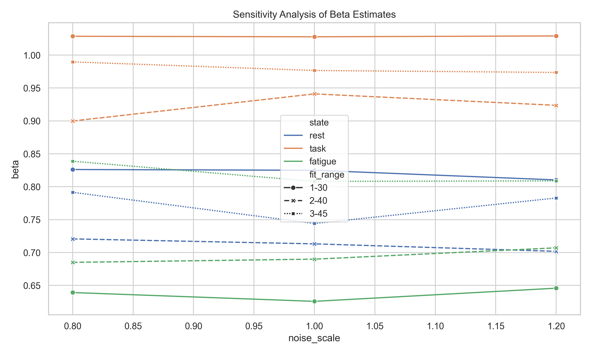

# QSS Framework for Cognitive EEG Dynamics

Computational operationalisation of quasi-steady-state (QSS) stability, temporal coherence, and aperiodic neural dynamics in cognitive EEG.

---

# Repository Status

## Current State

This repository has evolved from an initial theoretical draft into a reproducible computational neuroscience framework with:

- automated synthetic EEG simulation
- exploratory real EEG integration
- spectral parameterization using specparam
- QSS and temporal coherence estimation
- statistical validation and sensitivity analysis
- automated publication-quality figure generation
- reproducible pipeline execution

---

# Motivation

This project operationalises the QSS-noise-coherence framework proposed by Prof. Sisir Roy into measurable EEG computational features.

The framework studies:

- quasi-steady-state (QSS) stability
- structured neural noise
- temporal coherence
- aperiodic EEG dynamics (1/f structure)

across cognitive states:
- resting state
- cognitive engagement
- fatigue

---

# Key Improvements Implemented

The repository was significantly revised following methodological review feedback.

| Reviewer Concern | Resolution Implemented |
|---|---|
| Purely conceptual framing | Reframed as computational operationalisation |
| No reproducibility | Full reproducible repository created |
| No real EEG grounding | Integrated PhysioNet EEG dataset |
| Simple regression fitting | Added specparam/FOOOF spectral parameterization |
| Lack of uncertainty analysis | Added statistical validation and sensitivity analysis |
| No ancillary support | Automated figure/result generation added |
| Overstated claims | Softened to exploratory methods framing |

---

# Computational Pipeline

## Full Pipeline Overview

```text
Synthetic EEG / Real EEG
            ↓
Preprocessing
            ↓
Power Spectral Density (Welch)
            ↓
specparam Spectral Parameterization
            ↓
Aperiodic Exponent Estimation
            ↓
Sliding Window Temporal Analysis
            ↓
QSS + Temporal Coherence
            ↓
Statistical Validation
            ↓
Automated Figure Generation
```

---

# Repository Structure

```text
qss_framework_arxiv/
│
├── analysis.py
├── synthetic_generator.py
├── real_eeg.py
├── real_comparison.py
├── sensitivity_analysis.py
├── statistics_validation.py
├── plotting.py
├── advanced_plots.py
├── composite_figures.py
├── state_space.py
├── run_pipeline.py
│
├── data/
├── figures/
├── results/
└── README.md
```

---

# Installation

```bash
git clone https://github.com/Janaki21/qss_arxiv.git

cd qss_arxiv

python -m venv venv

source venv/bin/activate

pip install -r requirements.txt
```

---

# Run Entire Pipeline

```bash
python run_pipeline.py
```

The pipeline automatically:

- downloads EEG data
- preprocesses signals
- computes PSDs
- estimates aperiodic exponents
- computes QSS and temporal coherence
- runs statistical validation
- generates all figures/results automatically

---

# Real EEG Dataset

Integrated dataset:

PhysioNet EEG Motor Movement/Imagery Dataset

https://physionet.org/content/eegmmidb/1.0.0/

Automatically downloaded through the pipeline.

---

# Core Results and Figures

---

# 1. Spectral Analysis

Power spectral density and aperiodic fits across cognitive states.



Demonstrates:
- spectral differentiation
- oscillatory structure
- aperiodic slope variation
- temporal beta dynamics

---

# 2. State-Space Representation

QSS-coherence state space visualization.



Illustrates:
- clustering of cognitive states
- differentiation between synthetic and real EEG
- QSS vs coherence organization

---

# 3. Sensitivity Analysis

Robustness of beta estimation across:
- fit ranges
- noise scales
- parameter variations



Addresses reviewer concerns regarding:
- parameter sensitivity
- robustness
- reproducibility

---

# 4. Statistical Validation

Automated statistical validation pipeline generates:
- repeated simulations
- variability tracking
- state comparisons
- robustness metrics

Generated outputs stored in:

```text
results/
```

Including:
- summary.csv
- statistics.csv
- real_eeg_comparison.csv
- sensitivity_analysis.csv

---

# Methodological Positioning

This repository is intended as:

- a computational methods framework
- a synthetic validation study
- an exploratory real EEG applicability analysis

This work is NOT presented as:
- a definitive consciousness classifier
- a clinical EEG diagnostic system
- a conclusive empirical neuroscience claim

---

# Current Status

## Computational Infrastructure

| Component | Status |
|---|---|
| Synthetic EEG simulation | ✅ |
| Real EEG integration | ✅ |
| specparam integration | ✅ |
| Temporal coherence analysis | ✅ |
| QSS computation | ✅ |
| Statistical validation | ✅ |
| Sensitivity analysis | ✅ |
| Automated figure generation | ✅ |
| Reproducible repository | ✅ |

---

# Next Steps

Current focus:
- manuscript refinement
- confidence interval analysis
- real EEG preprocessing refinement
- arXiv preprint preparation

Future direction:
- meditation EEG analysis
- extended coherence studies
- higher-order consciousness state modeling

---

# Outputs

## Figures

Generated automatically inside:

```text
figures/
```

## Results

Generated automatically inside:

```text
results/
```

---

# Citation

Preprint currently under preparation.

Author:
Janaki Nageshwaran  
Department of Artificial Intelligence and Machine Learning  
SRM Institute of Science and Technology

---

# Acknowledgements

Conceptual inspiration and guidance:
Prof. Sisir Roy

Methodological review feedback:
Prof. Visvanathan Ramesh